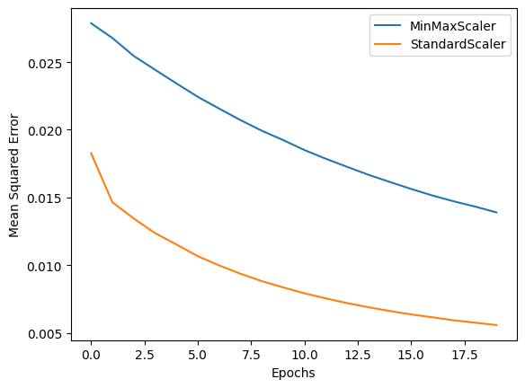

# ChangeLog

## Changes

### Project Goals
 This project was inspired and guided by a Jupyter notebook that creates a custom Artificial Neural Network to complete a Binary Classification task. This notebooks can be found [here](https://www.kaggle.com/code/mahimashukla12/binary-classification-churn-problem) for credit to the author and reference for those interested.
  The notebook referenced creates a Neural Network and trains its to classify whether a credit card customer will switch banks using a dataset of customer information. This goal of this project adapts that code and attempts to instead use Regression to return the probability that a Graduate student will be admitted to Masters programmes based on a number of features around the student and rating of the college.

### Data Source
<p> The source notebook utilises a different dataset as per its project requirements. This project instead uses the dataset explained below:

1. **Graduates Admission Prediction**
    - **Description**: This dataset is from information gathered about Indian colleges and their admissions history. The colleges are not identified but instead placed in buckets under their overall rating. The dataset contains 500 rows with 7 features including data like the student GPA, college rating and quality of the letter of recommendation and a final column which is a probability from 0 to 1 of admission to the college. The dataset was compiled to help students in shortlisting which colleges they should apply to given the average chance of admission based on these 7 features.
    - **Usage**: This dataset will be used to develop a Neural Network to return the probability of admission given the inpiut parameters.
    - **Source Quality**: This dataset was sourced from Kaggle and has a high usability score from Kaggle users.
    - **Link**: [here](https://www.kaggle.com/datasets/alessiocorrado99/animals10/download?datasetVersionNumber=2)</p>

### Data Exploration
<p> As this project is using a different dataset, some data exploration and preprocessing is required to make sure the data is clean and ready for modelling. The first steps in data exploration was to perform preliminary data exploration to understand the dataset and its features. There are 500 rows in total in the dataset with the following features:

1. GRE Scores - This is a common entrance exam in India.
2. TOEFL Scores - This is a English Test commonly used in India.
3. University Rating - This is on a discrete scale of 1 to 5.
4. SOP - This is a rating of the Statement of Purpose on a continuous scale of 1 to 5.
5. LOR - This is a rating of the Letter of Recommendation on a continuous scale of 1 to 5.
6. CGPA - This is the Undergraduate GPA the candidate achieved on a continuous scale from 1 to 10
7. Research Experience - A Binary value of either 0 - None or 1 - Have Research Experience
8. Chance of Admit - The probability that the candidate will achieve admission between 0 and 1.

Visualising these totals on a graph we can immediately see that:
- GRE, TOEFL, CGPA and Chance of Admit values follow a normal distribution
- Research Experience is a binary value
- All other columns while having uneven distribution are scale values


Given these distribution, I do not think that uneven distribution will cause problems for training our algorithm.

The next change in data exploration was to check if the dataset needs any cleaning. The usual steps were taken to find any rows with null values or duplicated rows. For this dataset neither problems were found so proceeding to additional data preprocessing could proceed.

### Data Processing

#### Create feature vector and dependent variables
As all columns were numeric, no data transformation were required and the project could proceed to seperating the dependent variable from the feature vector. This was done using the code below by seperating out the column to be predicted that being "Chance to Admit".

```
X = data_grad.drop(['Chance of Admit '], axis=1)
X = X.values
y = data_grad['Chance of Admit ']
y = y.values
```

#### Create training and test data
No changes were required here and the data was split into training and test data at a 80/20 data split.

#### Data transformations
In the project being followed, StandardScalar was used to transform the data before training. In this project, a change was made were both MinMaxScalar and StandardScalar were used seperately so the best method for normalisation/scaling could be deduced for this project's particular needs. StandardScalar removes unit variance but that may be deterministic for this project so both methods were to be tested seperately to determine the best method using the code below:

```
scale=MinMaxScaler()
X_train_norm=scale.fit_transform(X_train)
X_test_norm=scale.fit_transform(X_test)

scale=StandardScaler()
X_train_scale=scale.fit_transform(X_train)
X_test_scale=scale.fit_transform(X_test)
```

### Model Creation

#### Model 1
For the creation model one, a similar model as the source notebook was used for the first attempt. This was an extremely simple model with the first layer of 3 neurons serving as both an input layer and a processing layer. The change made to this model was to change the output activation function from sigmoid to linear to convert the neural network from a binary classification task to a Regression task.


#### Model 1 Details
A model summary can be vieweed in the image below:


Further changes:
- The loss function was changed the mean squared error (mse) to change the model to a Regression model.
- Adam as the optimizer to minimise the loss function.

#### Model 1 Evaluation

As this task is changing from binary classification to Regression, to evaluate the model mean_squared_error is used instead of accuracy to assess model performance.


1. With 12 Epochs of Training:
    - mse: 0.25
2. With 20 Epochs of Training:
    - mse: 0.0124


Model 1 performance with 12 Epochs of training was an mse of .25. As all columns are normalised between 0 and 1, we can see that model performed poorly. This result is not surprising given its simplicity and short training duration.
With an increased training duration of 20 Epochs, the model improved significantly better with an mse of .0124 showing that an increased training duration does continue to improve performance. However, this result can probably be improved with a more complex model.
To evaluate the difference in performance between MinMaxScalar and StandardScalar, the results using StandardScalar were also tested.



The model using the StandardScalar training data increased in performance to an mse of .00613. However, after reviewing these results, they seem too good given the simplicity of the model being used. Given this, we could guess that the model is underfitting to the data and the results obtains highly variant based on the starting weights being used.

To test for this the following function was created to test for variability in the results obtained.

```
# Define function to create and train the model
def train_model(model, X_train, y_train, epochs):
    model.compile(loss='mean_squared_error', optimizer='adam')
    history = model.fit(X_train, y_train, epochs=epochs, verbose=0)
    return model, history

# Train the model multiple times with normalised training data
num_runs = 20
mse_scores = []

for i in range(num_runs):
    print(f"Training Run {i + 1}/{num_runs}")
    model, history = train_model(model1, X_train_norm, y_train, 20)
    y_pred = model.predict(X_test_norm)
    mse = mean_squared_error(y_test, y_pred)
    print(f"MSE for Run {i + 1}/{num_runs}: {mse}")
    mse_scores.append(mse)

# Calculate average
average_mse = np.mean(mse_scores)
print(f"Average MSE across {num_runs} runs: {average_mse}")
```

This function trained the model 20 times and monitored how variable the results obtained were.


The results found did show variability across runs which may mean the model is underfitting to the overall patterns of the data and converging to local optima instead of global maximum depending on different starting conditions.


#### Model 2
For Model 2, the model is much more complex with the number of neurons increased to 11 and an additional hidden layer added with 11 neurons. Both layers now use Relu for their activation function in an attempt to increase the models ability to model more complex patterns in the dataset. This model also splits off a validation set from the training data so we can also evaluate its performance on unseen data as the model is trained. The training time will also be increased to give the model more time to learn the patterns in the data. 


#### Model 2 Evaluation


Performance:
- Training MSE: 0.035
- Validation MSE: .0036
- Test MSE: 0.0046
- Average Test MSE over 20 runs: 0.0049
- Standard Scalar -> Average Test MSE over 20 runs 0.0079

Evaluating these results:
- Training and Validation MSE are close to each other suggesting the model performs well on unseen data.
- Overall performance is significantly improved over Model 1 with an MSE of 0.0046 on Test Data
- Still a gap between performance in Training vs performance on Test data suggesting that there is still variability on unseen data and the model may be overfitting to the training and validation sets. The difference however is quite small.
- The average performance of the model over 20 training runs is close to the Test MSE suggesting the the model is converging to similar performance showing that it is not underfitting near as much as Model 1.
- The average performance for StandardScalar is slightly worse that the performance for MinMaxScalar with .0079 vs .0049 respectively. This suggests that the unit variance in the dataset is significant to the task of learning to deduce the correct Chance to Admit

#### Model 3
For Model 3, a further change that was made to the project was to experiment with using GridSearchCV to tune hyperparameters with Neural Networks.
Credit to https://www.kaggle.com/code/aaryandhore/neural-network-gridsearchcv-explanations for the code for using GridSearchCV with neural networks.
The following function was adapted from the code above to produce the following function:

```
from keras.models import Sequential
from keras.layers import Dense
from scikeras.wrappers import KerasRegressor
from sklearn.model_selection import GridSearchCV
import numpy as np

# Define Keras model creation function
def create_model():
    model = Sequential()
    model.add(Dense(11,activation='relu',input_dim=7))  
    model.add(Dense(11,activation='relu'))       
    model.add(Dense(1,activation='linear'))
    model.compile(loss='mean_squared_error')
    return model

# Create KerasRegressor wrapper
keras_regressor = KerasRegressor(build_fn=create_model)

# Define parameter grid
param_grid = {'batch_size': [16, 32],
              'epochs': [50, 100],
              'optimizer': ['Adam', 'RMSprop', 'SGD']}

# Perform GridSearchCV
grid_search = GridSearchCV(estimator=keras_regressor, param_grid=param_grid, cv=3, scoring='neg_mean_squared_error', verbose=2)
grid_result = grid_search.fit(X_train, y_train)

# Print best parameters and best MSE
print("Best Parameters: ", grid_result.best_params_)
print("Best MSE: ", grid_result.best_score_)
```
This function tries to find the optimal parameters for the following:
- batch size of data being fed in
- Number of epochs of training
- Optimizer for loss function being used with three of the most popular for Regression tested: Adam, RMSprop and SGD

The optimum parameters found were: Batch Size-> 16, Epochs-> 100 and optimizer-> RMSProp 

#### Model 3 Evaluation


- Training Set MSE: 0.0037
- Validation Set MSE: 0.0032
- Test Set MSE: 0.053

For Model 3, the results obtained for the training and validation data are better than for model 2, however it performed slightly worse on the test data. However, the differences here are very small indicating that the results obtained through additional epochs are not increasing and show that the model is reaching its maximum performance potential. Significant further gains with this model do not seem possible with only marginal changes to the results obtained. To achieve further performance, I think that additional complexity would have to be added to the model to learn more subtle difference in the patterns withing the data.


## Learning Outcomes

1. **Process of constructing Custom Neural Networks**
 This project gave me experience in the process of constructing a Neural Networks with the Keras library and how layers and their composition can be controlled and modified. It also showed how the complexity of the Neural Network defines the complexity of the task it is capable of learning with too simple a model highly prone to underfitting to the patterns in the data and overfitting to noise or outliers.

2. **Process of modifying a Neural Network from a Classification task to a Regression task**
 As part of this project, I had to modify a Neural Network to switch it from Classification to Regression which taught me about the different activation functions that can work for Regression tasks how to change the loss function to suit project requirements with mean squared error being used for this project.

3. **How GridSearchCV can be used in the tuning of Neural Networks**
 This project gave me experience of utilising GridSearchCV in the context of Artificial Neural Networks and the different parameters it is capable of cross validating such as Epochs, optimizer and batch size.

4. **How additional Epochs of training has a diminishing return after a certain point**
 While increasing the number of epochs during training initially improves the model's performance by reducing the training error, there comes a point where further epochs lead to overfitting on the training data. This results in diminishing returns as the model starts to memorize the training data rather than learning generalizable patterns.